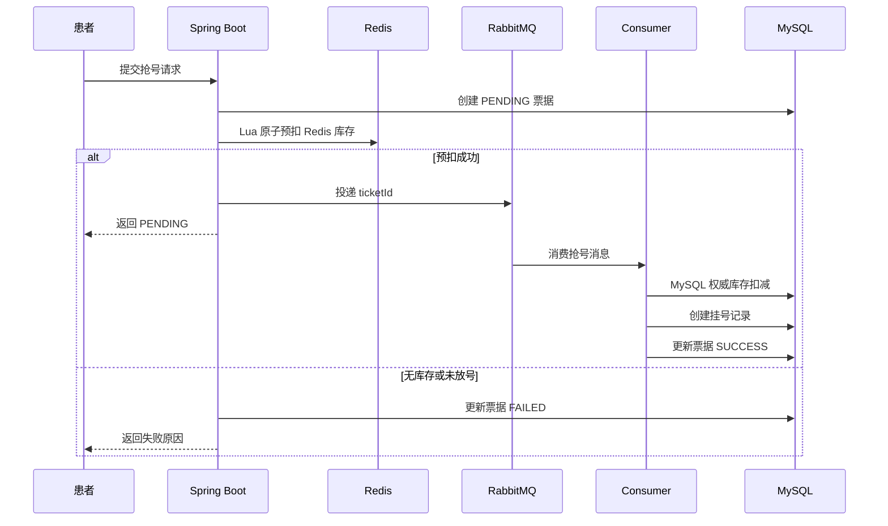
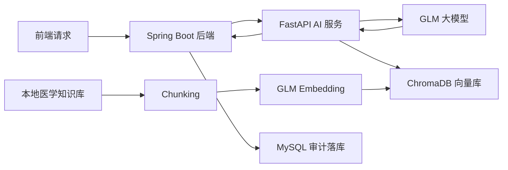

东软智慧云脑诊疗平台

一个面向医院门诊业务的后端项目，基于 Spring Boot 3 构建门诊挂号、医生接诊、检查检验、处置、处方、患者门户与账号权限等核心流程，并通过 Redis、RabbitMQ 和 Python AI 服务补充高并发抢号与智能辅助诊疗能力。

项目重点不是简单 CRUD，而是围绕真实业务场景补充了三个后端可讲点：

- **Redis 缓存与 Lua 原子扣减**：用于医生号源库存的高并发预扣减，减少数据库热点写压力。
- **RabbitMQ 异步削峰**：抢号请求先生成票据并返回处理中，后续由消费者异步完成 MySQL 权威库存扣减与挂号落库。
- **AI + RAG 接入**：Java 后端调用 Python FastAPI 推理服务，Python 侧接入 GLM、Pydantic 结构化输出、ChromaDB 向量库和本地医学知识库检索。

> 项目地址：[https://github.com/CorruptingHeart-Y/CloudBrain_Yang.git](https://github.com/CorruptingHeart-Y/CloudBrain_Yang.git)

## 技术栈

| 模块 | 技术选型 |
| --- | --- |
| 后端框架 | Java 17、Spring Boot 3.2.5、Spring MVC、Validation |
| 数据访问 | MyBatis-Plus 3.5.6、MySQL 8.0 |
| 缓存 | Redis 7、StringRedisTemplate、Lua Script、TTL |
| 消息队列 | RabbitMQ、Spring AMQP、DirectExchange、DLX |
| 认证授权 | JWT、角色权限、拦截器、ThreadLocal 当前用户上下文 |
| API 文档 | Knife4j / OpenAPI 3 |
| AI 服务 | Python、FastAPI、Pydantic、GLM、ChromaDB、RAG |
| 工程化 | Maven、Docker Compose、uv |

## 核心功能

### 账号与权限

- 支持 `ADMIN`、`DOCTOR`、`PATIENT` 三类角色。
- 使用 JWT 携带 `role`、`accountId`、`tokenVersion` 等信息。
- 通过登录拦截器解析 Token，将当前用户写入 ThreadLocal 上下文。
- 支持患者自助注册、账号启停、重置密码、修改密码后旧 Token 失效。
- 医生只能访问自己接诊范围内的数据，避免越权查看其他医生的患者记录。

### 门诊业务

- 基础字典：科室、员工、挂号级别、结算类别、药品、疾病、医技项目。
- 挂号与接诊：挂号记录、患者就诊记录、医生接诊范围校验。
- 医疗申请：检查申请、检验申请、处置申请、处方管理。
- 患者门户：患者查看个人资料、就诊列表和就诊详情。

### 高并发抢号

抢号模块模拟门诊预约中的热点号源竞争，采用 “Redis 快速预扣 + RabbitMQ 异步落库 + MySQL 权威校验” 的设计。



关键设计：

- Redis 库存 key：`regist:stock:{employeeId}:{visitDate}:{noon}`。
- 通过 Lua 脚本保证“判断库存 > 0”和“扣减库存”在 Redis 内原子执行。
- Redis 未命中时，从 MySQL 读取医生号源并懒加载到 Redis，使用 `SETNX` 避免并发重建覆盖已扣减库存。
- 票据表使用状态机：`PENDING`、`SUCCESS`、`FAILED`、`CANCELLED`。
- 通过数据库唯一约束保证“一名患者同一半日只能有一个有效抢号票据”。
- MQ 投递失败时，立即回补 Redis 库存并将票据标记为失败，避免库存和票据长时间不一致。
- 消费者重复消费时先检查票据状态，非 `PENDING` 直接跳过，实现消费幂等。

## AI 与 RAG

项目将 AI 能力拆成独立的 Python FastAPI 服务，Java 后端只负责业务编排、权限校验、数据落库和结果审计。



已接入的 AI 场景：

- **诊前分诊**：根据患者主诉、年龄、性别和候选科室/医生，返回推荐科室、医生和推荐理由。
- **处方审核**：根据患者信息与处方药品列表，识别剂量、禁忌、过敏和相互作用风险。
- **病历生成**：根据问诊信息生成结构化病历草稿，医生确认后再保存。

RAG 处理流程：

1. Python 服务启动时读取 `ai-service/knowledge` 下的 `.md` / `.txt` 知识文件。
2. 按段落和长度将知识文档切分为 chunk。
3. 使用 GLM Embedding 将 chunk 向量化。
4. 将 chunk 原文、向量和 metadata 写入 ChromaDB 持久化向量库。
5. 用户请求进入 AI 服务时，根据患者输入、处方药品、候选科室等业务字段构造检索 query。
6. 将 query 向量化后在 ChromaDB 中召回 top-k 相关知识片段。
7. 对召回结果做距离阈值过滤，将命中的知识片段拼入 Prompt。
8. GLM 基于“业务事实 + 检索证据”生成结构化 JSON。
9. Python 侧使用 Pydantic 校验输出结构，Java 侧再将结果返回或落库审计。

当前 RAG 属于轻量本地知识库实现，重点体现完整链路：知识库构建、向量化、向量检索、Prompt 注入、结构化输出和后端审计。医疗结论仍以医生确认和业务输入为准。

## 项目结构

```text
.
├── src/main/java/com/neusoft/hospital
│   ├── auth                 # JWT 认证、角色权限、当前用户上下文
│   ├── ai                   # Java 调用 Python AI 服务的客户端与业务编排
│   ├── common               # 统一响应、异常、分页
│   ├── config               # Redis、RabbitMQ、MyBatis-Plus、Knife4j 配置
│   ├── controller           # 门诊业务 REST API
│   ├── dto                  # 请求与响应 DTO
│   ├── entity               # 数据库实体
│   ├── mapper               # MyBatis-Plus Mapper
│   ├── mq                   # 抢号消息生产者与消费者
│   └── service              # 核心业务逻辑
├── src/main/resources
│   ├── application.yml      # 公共配置
│   ├── application-master.yml
│   └── lua/deduct_stock.lua # Redis 扣库存 Lua 脚本
├── ai-service
│   ├── app
│   │   ├── clients          # GLM 客户端
│   │   ├── rag              # RAG 检索与 ChromaDB 向量库
│   │   ├── routers          # FastAPI 路由
│   │   ├── schemas          # Pydantic 入参与出参模型
│   │   └── services         # AI 业务 Prompt 与结构化输出
│   └── knowledge            # 本地医学知识库
├── docker                   # MySQL / Redis 配置与初始化脚本
├── docs                     # 前端对接与部署文档
├── sql                      # 数据库初始化与迁移脚本
└── docker-compose.yml
```

## 本地运行

### 1. 启动基础设施

```bash
docker compose up -d
```

默认启动：

- MySQL：`localhost:3306`，数据库 `hospital_cloud_brain`，密码 `hospital2024`
- Redis：`localhost:6379`，密码 `hospital2024`
- RabbitMQ：`localhost:5672`，管理后台 `http://localhost:15672`

RabbitMQ 默认账号：

```text
admin / admin2024
```

### 2. 启动 Java 后端

```bash
mvn -DskipTests compile
mvn spring-boot:run
```

接口文档：

```text
http://localhost:8080/doc.html
```

### 3. 启动 Python AI 服务

```bash
cd ai-service
uv sync
uv run uvicorn app.main:app --reload --port 8000
```

AI 服务需要在 `ai-service/.env` 中配置：

```bash
GLM_API_KEY=your_glm_api_key
INTERNAL_KEY=change-me-shared-with-springboot
RAG_ENABLED=true
```

健康检查：

```text
http://localhost:8000/health
```

RAG 知识库重建：

```bash
curl -X POST http://localhost:8000/ai/rag/reload ^
  -H "X-Internal-Key: change-me-shared-with-springboot"
```

## 常用命令

```bash
docker compose up -d
docker compose down
mvn -DskipTests compile
mvn test
cd ai-service && uv run uvicorn app.main:app --reload --port 8000
```

## 设计亮点

### Redis：为什么不用直接查 MySQL 库存？

抢号是典型热点写场景，如果每个请求都直接访问 MySQL，会把压力集中到医生号源行上。项目将剩余号源缓存到 Redis，并使用 Lua 脚本做原子扣减，先在缓存层快速过滤大部分失败请求，再由 MQ 消费者异步完成 MySQL 权威扣减。

### RabbitMQ：为什么抢号后不直接落库？

抢号成功的用户不需要同步等待完整挂号记录创建完成。项目先创建 `PENDING` 票据，Redis 预扣成功后投递 `ticketId` 到 RabbitMQ，立即返回“处理中”。消费者异步创建挂号记录并更新票据状态，前端通过 ticketNo 查询最终结果。这样可以削峰、缩短接口响应时间，并通过票据状态机处理重复消费和失败补偿。

### RAG：为什么不用只调大模型？

普通大模型调用只依赖模型已有参数和本次 Prompt，容易出现知识不可控、解释不可追溯的问题。项目在 Python 服务中加入本地医学知识库，先检索相关片段，再将证据注入 Prompt，让模型基于“业务数据 + 检索资料”输出结构化结果。这样更适合处方审核、分诊推荐这类需要依据和边界的业务场景。

### Pydantic：为什么 AI 输出还要校验？

大模型输出本质上是不稳定文本。Python 服务用 Pydantic 定义固定响应结构，对 GLM 返回的 JSON 做字段、类型和枚举值校验。只有通过校验的结构化结果才返回给 Java 后端，避免不合法 JSON 或字段缺失直接进入业务系统。

## 后续可扩展方向

- 为 RabbitMQ 增加 Producer Confirm 与 Return Callback，进一步确认消息是否到达 Broker 和 Queue。
- 将死信队列中的失败消息接入后台告警或人工补偿页面。
- 将 RAG 知识库按药品、禁忌、相互作用、科室分诊规则拆分，并补充更细粒度 metadata。
- 在 AI 返回结果中增加 evidenceRefs，记录每条建议引用了哪些知识片段。
- 对处方审核结果、病历生成草稿增加更完整的医生确认与审计链路。

## 免责声明

本项目用于后端工程能力展示与学习实践，AI 输出仅作为辅助建议，不构成真实医疗诊断或用药依据。

